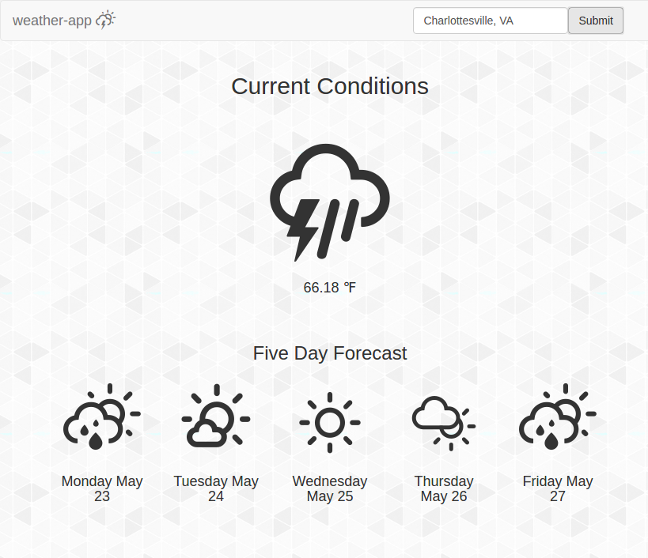

# :zap: weather-app :zap:



### Description

Weather-app is a little react.js app that show the weather forecast for a specified location.

### Installation

```
$ git clone https://github.com/andrewjesaitis/weather-app.git
$ cd weather-app
$ npm install
$ npm run start
```
